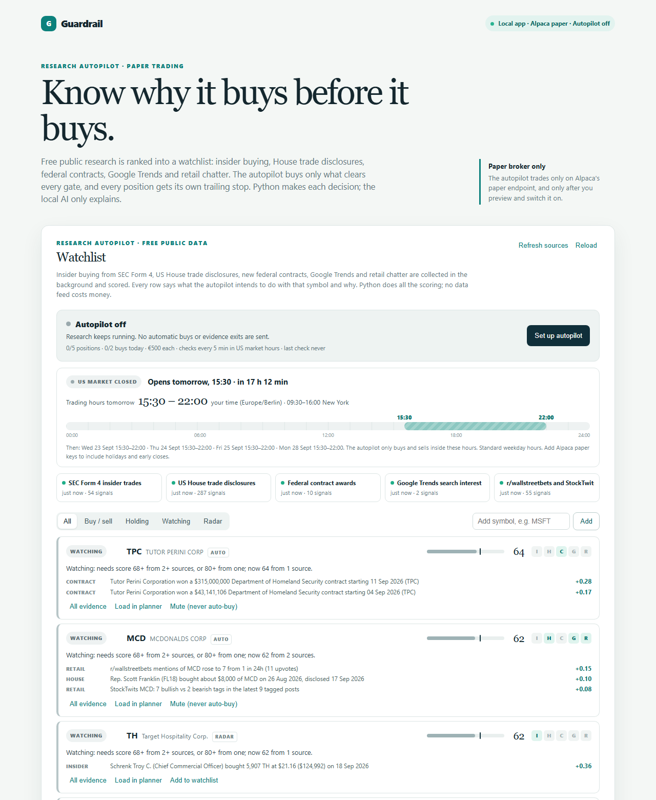

# Guardrail paper-trading assistant

[](https://github.com/Matthias-Johannes-Mack/TradingBot/actions/workflows/tests.yml)

Guardrail ranks free public research (insider trades, US House trade disclosures, federal contracts, Google Trends and retail chatter) into a watchlist. An optional autopilot turns that watchlist into Alpaca **paper** positions within hard limits. Every position gets a protective stop, and every decision is logged with its evidence. It also builds trailing-stop and dip-buy plans in euros, which a free local LLM can explain. Manual broker orders are submitted only after a separate preview and confirmation.



## Run in Docker

The container runs Guardrail and uses Ollama on the Windows host for local AI explanations. Ollama must be running with the model installed.

Add your **paper** API credentials to the existing `.env` file in the project root (or copy `.env.example` to `.env` first). Use these names:

```dotenv
APCA_API_KEY_ID=your_paper_key
APCA_API_SECRET_KEY=your_paper_secret
```

Docker Compose passes both values to the container and fixes the broker endpoint to `https://paper-api.alpaca.markets/v2`. The `.env` file is ignored by Git and excluded from the image. Do not put a live Alpaca key in this file.

```powershell
ollama pull qwen3.5:9b
docker compose up --build -d
```

Open `http://127.0.0.1:8000`. Check the container with `docker compose ps` and stop it with `docker compose down`. The app is bound to your computer only.

## Research autopilot and watchlist

The **Watchlist** panel at the top of the page is the autopilot's view. A background worker collects free public data, scores every symbol it hears about, and shows what the autopilot intends to do with each one and why.

| Source | What it adds | Refresh | Weight | Half-life |
| --- | --- | --- | --- | --- |
| [SEC EDGAR Form 4](https://www.sec.gov/cgi-bin/browse-edgar?action=getcurrent&type=4) | Open-market insider buys (code P) and sells (code S). Officers and directors count more than 10% funds; option exercises and grants are ignored. The daily index backfills the last 5 business days. | 15 min | 1.00 | 21 days |
| [US House disclosures](https://disclosures-clerk.house.gov/PublicDisclosure) | Members' periodic transaction reports, parsed from the Clerk's PDFs. Dated at disclosure, discounted for filing lag. | 1 h | 0.70 | 30 days |
| [USAspending.gov](https://www.usaspending.gov/search) | Newly signed federal contracts, matched to listed recipients by name. | 6 h | 0.40 | 45 days |
| [Google Trends](https://trends.google.com/trending) | Search interest for each watched company: a steady rise helps, a blow-off spike or fading interest counts against. Daily trending searches surface new names. | 6 h | 0.35 | 7 days |
| [ApeWisdom](https://apewisdom.io/wallstreetbets/) and [StockTwits](https://stocktwits.com) | r/wallstreetbets mention growth and StockTwits bull/bear tags. A mania or a one-sided board is a caution flag. | 30 min | 0.30 | 3 days |

These are the free primary sources behind QuiverQuant's congress, insider, contract, Trends and WallStreetBets datasets. No source needs an account or payment. The Senate's disclosure and lobbying sites block automated clients, so Senate trades and lobbying are not included. Set `GUARDRAIL_CONTACT` in `.env` to your email; the SEC asks automated clients to identify themselves.

**Scoring.** Each signal is weighted by its source, by its own size (dollar value, mention growth), and by age (half-life). Each source's total is capped, so thirty Reddit posts cannot outweigh one CEO buying $1M of stock. The sum becomes a 0–100 score: 50 means no evidence either way. Weights are research-based priors, not a fitted or backtested model; insider open-market buying is the best documented of these effects, and retail attention the weakest.

**Trading hours.** Below the autopilot switch, a strip shows whether the US market is open, the next session in your own time zone (normally 15:30–22:00 in Germany), and a countdown to the next open or close. A 24-hour bar highlights the session. The times come from Alpaca's market calendar, so exchange holidays and early closes are included. Without Alpaca keys, the strip falls back to standard weekday hours. The autopilot only buys and sells inside these hours.

**Watchlist rows.** A symbol joins the list automatically at score 58 with two independent sources, or 63 from one. It leaves once its score falls below 53. You can add symbols yourself, mute a symbol so it is never auto-bought, and open **All evidence** to see every filing or feed row behind a score, with links. The **Radar** filter shows the strongest symbols that have not qualified yet. Each row carries one intent:

- **Buy next** – clears every gate; the next market-hours check buys it if the price and liquidity checks pass.
- **Buy candidate** – qualifies, but something blocks it (autopilot off, no free slot, daily limit, cooldown).
- **Holding** / **Sell next** – an autopilot position; Sell next means its evidence turned bearish.
- **Watching** / **Avoid** – not enough evidence, a caution flag, or net-bearish evidence.

**Autopilot.** Off by default. Open **Autopilot settings and switch**, preview, tick the authorization, and switch it on. While on, it checks every 5 minutes during US market hours, even with the browser closed:

1. It buys at most one symbol per check that has a score of 68 or more from at least two sources (or 80 or more from one) and no caution flag. The symbol must also be an active Alpaca stock with a fresh IEX trade, cost $3 or more, and average at least $500k of IEX volume a day.
2. It sizes each buy from a EUR budget (default €500) at the ECB rate, in whole shares with a market order. It holds at most 5 positions and makes at most 2 new buys a day, and it skips any symbol you already hold or manage manually.
3. It hands every position to an automatic stop plan with re-entry switched off. The plan sets a hard floor 8% below the fill and trails 6% below the high after +8%.
4. It sells early when a position's score drops below 38 (net bearish evidence, such as insiders or House members selling). It cancels the stop first, then sends a market sell. After any exit, the symbol is on a 10-day cooldown.

Every buy, sell, skip and switch change goes to the **Autopilot log** with the evidence it acted on. Orders use durable client IDs, so a crash or restart cannot double-buy. Pausing the autopilot stops new buys and evidence exits; existing positions keep their stop plans until you pause those in **Automatic paper plan**.

**What to expect.** These signals are public, free and delayed. House reports can be up to 45 days old, and insider filings arrive within 2 business days. Many other traders see the same data. Nothing here guarantees a profit, and market orders, gaps through stops, FX, fees and German tax all reduce results. Run it on the paper account long enough to judge the log before trusting it with anything else. This app only supports Alpaca's paper endpoint.

## Alpaca paper workflow

1. Set the euro strategy and review its calculated levels.
2. Use **Broker orders** to preview one Alpaca paper order. The preview shows the USD value Alpaca receives and its EUR estimate using the latest [ECB daily EUR/USD reference rate](https://data.ecb.europa.eu/help/api/data-examples).
3. Confirm the order. Guardrail immediately shows the ID and status returned by Alpaca. Refresh the broker panel to see the current position and open orders.

The broker panel supports market buys, full-position hard stops, eligible ladder limit buys, and manual trailing-stop activation. A market buy may still be pending when submitted; wait for a fill and refresh the position before submitting the hard stop. If a Guardrail hard stop exists when you activate a trailing stop, Guardrail cancels it and submits the trailing stop, attempting to restore the prior stop if submission fails.

The candlestick chart refreshes its free IEX single-exchange data every 15 seconds while the page is visible. By default it overlays only priced open broker orders and the order currently being previewed. Choose **Reviewed plan** in the chart to add the reviewed hard stop, trailing activation, and eligible ladder levels. Levels outside the candle range are listed below the chart rather than stretching the price axis; unpriced market orders have no horizontal line.

German after-tax estimates default to no church tax: 25% capital-gains tax plus a 5.5% solidarity surcharge on that tax, or 26.375% on taxable gains (displayed as 26.38%). The unused allowance defaults to zero. If church tax applies to you, choose 8% (the usual Baden-Württemberg rate) or the listed 9% exception. These are estimates, not German tax withholding by Alpaca; the actual EUR cost basis, exchange rate, fees, loss offsets, and tax circumstances can change the result.

The Alpaca Trading API paper account and US stock order prices are USD. The app's euro values are display estimates, not an FX execution rate. Broker order prices are calculated from Alpaca's actual USD average entry, which may differ from the euro strategy inputs. This initial broker connection does not automatically activate trailing stops or resize a stop after a ladder buy fills. Review those orders again when the position changes. The local price-tick simulator never submits broker orders.

## Run without Docker

1. Install [Ollama](https://ollama.com/download) and pull a free model:

   ```powershell
   ollama pull qwen3.5:9b
   ```

2. Create and activate a virtual environment, then install the app dependencies:

   ```powershell
   python -m venv .venv
   .\.venv\Scripts\Activate.ps1
   pip install -r requirements.txt
   ```

3. Optionally copy `.env.example` to `.env` and choose another locally installed Ollama model.

4. Start the app:

   ```powershell
   uvicorn app.main:app --reload
   ```

Open `http://127.0.0.1:8000`.

## Releases and Docker image

Every merge to `main` that changes code runs the [Release workflow](.github/workflows/release.yml):

1. It runs the tests.
2. It works out the next version from the commit messages since the last `v*` tag.
3. It pushes the image to the GitHub Container Registry, and to Docker Hub if that is set up.
4. It tags the commit and publishes a GitHub release with generated notes.

The tag is created last, so a failed test, build or push never leaves a version without an image. Changes that only touch docs don't trigger a release.

| Commit message since the last release | Next version |
| --- | --- |
| `feat!: ...` or a `BREAKING CHANGE:` line in the body | major, `0.4.1` → `1.0.0` |
| `feat: ...` | minor, `0.4.1` → `0.5.0` |
| anything else | patch, `0.4.1` → `0.4.2` |

The first release is `v0.1.0`. To force a specific bump, use **Actions → Release → Run workflow**. Each image is tagged with the full version, the minor line, `latest` and the short commit SHA, and carries build provenance and a software bill of materials:

```bash
docker pull ghcr.io/matthias-johannes-mack/trading-bot:0.4.2
docker pull wirefire071/trading-bot:0.4.2
```

To run a published image instead of building locally, replace `build: .` in `compose.yaml` with `image: ghcr.io/matthias-johannes-mack/trading-bot:0.4.2` or `image: wirefire071/trading-bot:0.4.2`.

The GitHub Container Registry needs no setup: it is free for public repositories, and the workflow signs in with its own short-lived token. The image is linked to this repository and listed under **Packages**.

**Docker Hub:** the same tags go to [`wirefire071/trading-bot`](https://hub.docker.com/r/wirefire071/trading-bot) when these exist under **Settings → Secrets and variables → Actions** in this repository. A free Docker Hub account is enough for public images.

- the variable `DOCKERHUB_USERNAME`: `wirefire071`;
- the secret `DOCKERHUB_TOKEN`: a Docker Hub personal access token with Read & Write scope, created under Docker Hub → Account settings → Personal access tokens.

Without them, releases go to the GitHub Container Registry only, and the run shows a notice saying Docker Hub was skipped. If you set up Docker Hub after a release, run **Actions → Release → Run workflow** with `republish`. It copies the latest release, including its provenance and SBOM, to Docker Hub with the same tags, without building again or creating a new version.

## Auto-update from Docker Hub

[`compose.hub.example.yaml`](compose.hub.example.yaml) runs the published image and keeps it on the newest release. [What's Up Docker](https://getwud.github.io/wud/) (WUD) checks Docker Hub every 15 minutes for a newer `x.y.z` tag of `wirefire071/trading-bot`. When it finds one, it:

1. writes the new tag into your local `compose.hub.yaml`;
2. pulls the image;
3. replaces the `guardrail` container with the same settings and data volume;
4. deletes the old image.

WUD only watches containers labelled `wud.watch=true`, so no other container on your machine is watched or touched. Its dashboard is at [http://127.0.0.1:3100](http://127.0.0.1:3100); log in as `admin`.

One-time setup, in PowerShell from the repository folder:

1. Add `WUD_ADMIN_PASSWORD=` with a password of your choice to `.env`.
2. Copy the template; your copy is git-ignored because WUD edits it:

   ```powershell
   Copy-Item compose.hub.example.yaml compose.hub.yaml
   ```

3. Stop the locally built app. Your data volume is kept:

   ```powershell
   docker compose down
   ```

4. Start the published image and WUD:

   ```powershell
   docker compose -f compose.hub.yaml up -d
   ```

The hub setup uses the same project, service and volume names as `compose.yaml`, so Guardrail keeps its data when you switch. Run one setup or the other, not both. To go back to building from source, run `docker compose -f compose.hub.yaml down`, then `docker compose up --build -d`.

- **Every release is applied automatically, including major versions.** To hold back major releases, add `WUD_TRIGGER_DOCKERCOMPOSE_GUARDRAIL_THRESHOLD: minor` to the `wud` service.
- **Running `docker compose -f compose.hub.yaml up -d` after an update** restarts Guardrail once. It keeps the new version, because the tag in `compose.hub.yaml` was updated too.
- **WUD has access to the Docker socket, which means full control of Docker on this machine.** That's why its image is pinned by digest and its dashboard only listens on `127.0.0.1`.

## What the app does

- Calculates euro hard-stop and trailing levels for simulation.
- Creates a configurable three-level averaging ladder.
- Requires a review step before a paper strategy can be armed.
- Accepts manual euro price ticks and records simulated fills.
- Uses `langchain-ollama` only for explanation; risk levels and simulated orders are calculated in Python, never delegated to the LLM.
- Scores free public research into a watchlist and, when switched on, runs a limit-bound paper autopilot.

## Contributing

Issues and pull requests are welcome. `main` is protected: every change goes through a pull request, needs the tests to pass and needs an approving review from the code owner (see [CODEOWNERS](.github/CODEOWNERS)). Force pushes and deleting `main` are blocked. Workflows from outside contributors' pull requests only run after approval, and pull requests from forks never receive the Docker Hub token.

## Data sources and terms

Every research source is free and public, and the app reads it at low volume for personal research. The SEC asks automated clients to identify themselves with a contact email (`GUARDRAIL_CONTACT`) and to stay under 10 requests a second; the app waits between calls to every host. Google Trends, StockTwits and ApeWisdom are read through the same endpoints their websites use. These are not documented public APIs, so they can change or refuse access at any time. Check each site's terms before using this beyond personal, educational use.

## License

[MIT](LICENSE). This project is educational software, not investment advice.
